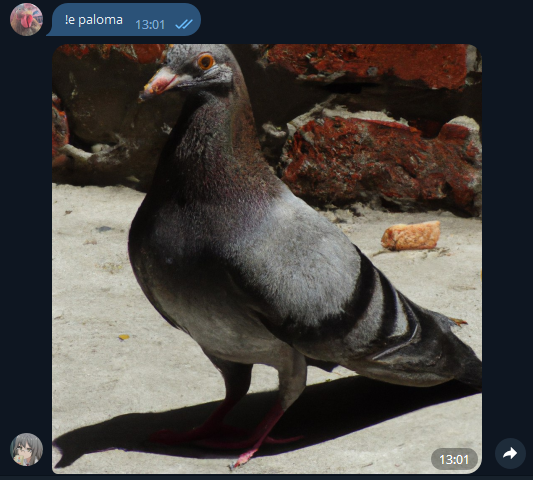
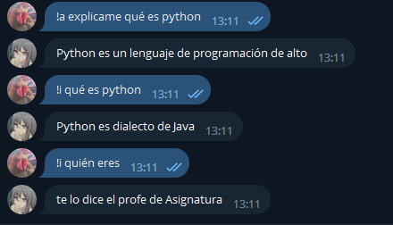

<h1 align="center">BOT TELEGRAM CHATGPT</h1>
<h1 align="center">Preview</h1>

Realizado en PHP. Código totalmente creado por mí, no brindo soporte.. idk

<h1 align="center">Cómo usar?</h1>

 • Puedes usar <a href="https://replit.com">replit.com</a> y <a href="https://uptimerobot.com/">uptimerobot.com</a>

 Replit.com => Para hostear tu bot 

 Uptimerobot.com => Para mantener el host activo de Replit 

<h3 align="center">Porqué hacer esto?<h3>

Para mantener una conexión Segura(SSL), es necesario hacer esto y también por el host gratuito, en caso que desees pagar un hosting/dominio, puedes hacerlo.

<h1 align="center">Hola 👋, Developer: Nestor Ramos</h1>
  <h3 align="center">Un apasionado desarrollador Backend de Perú</h3>
<h3 align="center">Contáctame en:</h3>

<h3 align="center">Lenguajes y Herramientas:</h3>

      

